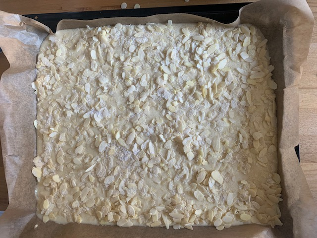

# General

Simple quick 'n' dirty buttermilk cake. Great for children's birthdays; it tastes best fresh, and if you send it with the kids to a bake sale, there's often plenty left over x-D

# Ingredients

## Cake Batter

* 400g flour
* 220g sugar
* 3 eggs
* half a teaspoon of salt
* 1 packet of vanilla sugar
* 500 ml buttermilk
* 1 packet of baking powder

## Topping

* at least 300g almonds (sliced or slivered)
* 2 packets of vanilla sugar
* 110g butter

# Preparation

## Preparation

1. Place all ingredients for the batter in a bowl and mix thoroughly.
2. Prepare a large, flat baking sheet (e.g., line with baking paper).
3. Spread the batter evenly over the baking sheet.
4. Evenly distribute the almonds for the topping over the batter.
5. Sprinkle vanilla sugar over the cake.

## Baking

6. Preheat the oven to 190°C (convection).
7. Place the baking sheet on the middle rack.
8. Bake for 20 minutes at 180°C (convection).

## Finishing Touch

9. Melt 110g butter.
10. Pour the melted butter over the cake.

# Comments

* Extremely easy to prepare
* Quantities can be easily adjusted