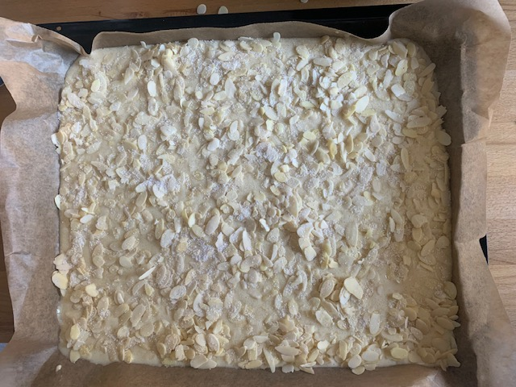
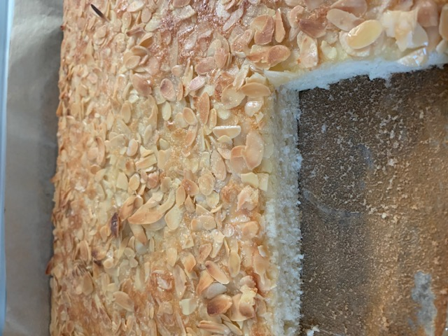

# Allgemein

Einfacher quick'n dirty Buttermilchkuchen. Passend für Kindergeburtstage,
schmeckt frisch am besten und wenn man ihm dem Nachwuchs mit zum Kuchenbasar gibt,
bleibt er oft übrig x-D

# Zusaten

## Kuchenteig

* 400g Mehl
* 220g Zucker
* 3 Eier
* halber Teelöffel Salz
* 1 Päckchen Vanillezucker
* 500 ml Buttermilch
* 1 Päckchen Backpulver

## Belag

* mindestens 300g Mandeln (PLättchen oder Stifte)
* 2 Päckchen Vanillezucker
* 110g Butter

# Zubereitung

## Vorbereitung

1. Alle Zutaten für den Teig in eine Schüssel geben und durchrühren
2. großes, flaches Backblech vorbereiten (z.B. Backpapier auslegen)
3. Teigzutaten auf das Backbleck geben und gleichmäßig verteilen
4. Mandeln für den Belag gleichmäßig auf dem Teig verteilen
5. Vanillezucker auf den Kuchen streuen

## Backen

6. Ofen auf 190 °C vorheizen (Umluft)
7. Blech in die mittlere Schiene einhängen
8. 20' bei 180 °C backen (Umluft)

## Nachbereitung

9.  110g Butter zerlassen
10. Zerlassene Butter über den Kuchen geben

# Kommentare

* Extrem einfach in der Zubereitung
* Mengen können einfach variiert werden