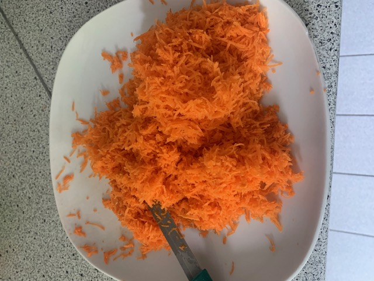
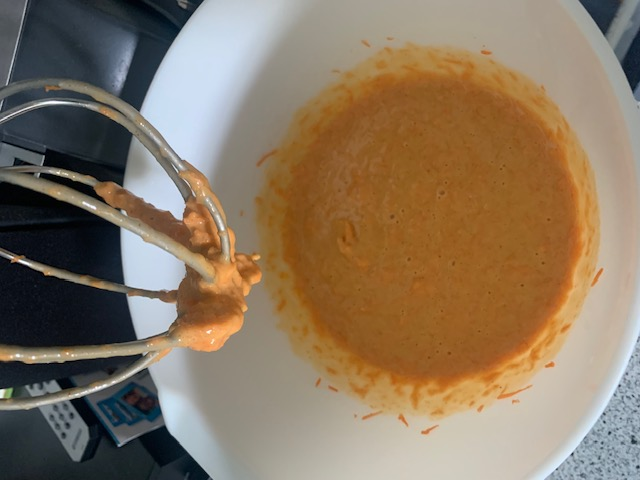
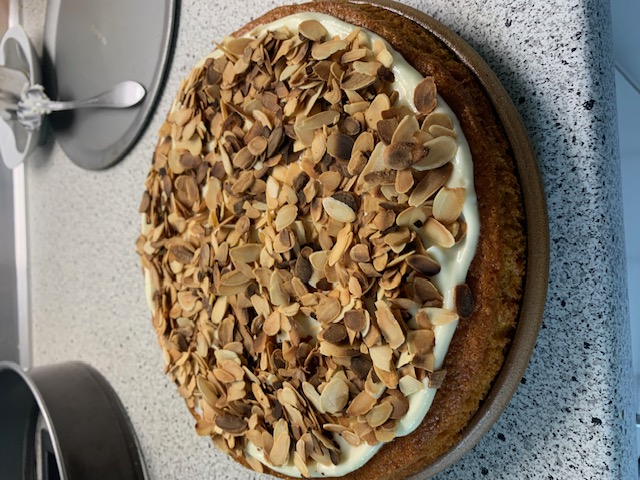
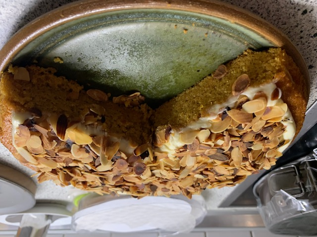

# Allgemein

Einer der überraschensten Kuchen die ich je gegessen habe ... und das Beste er bleibt ewig frisch X-D

# Zusaten

## Kuchen

* 175 g Mehl
* 250 g Karotten
* 3 Eier
* 120 g Zucker
* 1 Päckchen Backpulver
* 2 Päckchen Vanillezucker
* 125 ml Raps- oder Sonnenblumenöl
* 1 TL Zimt
* 1 TL Kadamon
* 1/2 TL Ingwer Pulver
* etwas Salz

## Belag

* 100 g Frischkäse - Vollfett Stufe X-D
* 60 g Butter
* 2 TL Zitronensaft
* max 40 g Puderzucker
* 1 Päckchen Mandelscheiben oder andere Nüsse

# Zubereitung

1. Karotten schälen, waschen (!) und klein raspeln
2. Mehl mit dem Backpulver und den Gewürzen mischen
3. Eier, Zucker und Vanillezucker cremig schlagen
4. Mehlmischung und Öl zu den Eiern geben und durchmischen
5. Backform (runde Springform) vorbereiten (fetten oder mit Backpapier auslegen)
6. Teigmischung in Backform geben
7. 45' - 50', bei 160 °C (Ober-/Unterhitze) auf der mittleren Schiene backen  
8. Mandeln in der Pfanne rösten und kalt werden lassen
9. Butter und Frischkäse zu einer cremigen Masse verrühren
10. In diese Masse den Puderzucker sieben und verrühren
11. Zum Schluss den Zitronensaft unterrühren
12. Den abgekühlten Kuchen mit dem Belag bestreichen und die gerösteten Nüsse drauf verteilen
13. Fertig :)

# Kommentare

Ich habe den Kuchen auch schon mit 280 g Möhren gebacken. Grundsätzlich interessiert mich wie weit ich
den Anteil der Möhren noch erhöhen kann. Bei Belag ist am Ende entscheidend, dass er leicht säuerlich
schmeckt. Auch die Verwendung von etwas salzigerem Frischkäse hat nicht zu einem schlechteren Ergebnis
geführt.

Der Kuchen bleibt locker 4 Tage im Kühlschrank frisch.