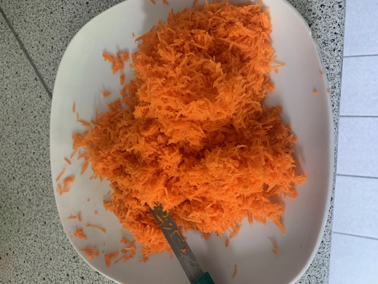
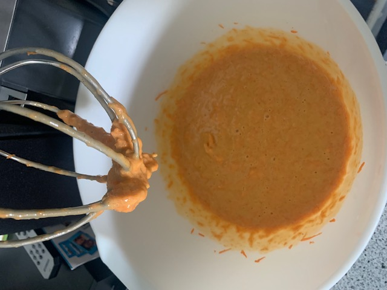
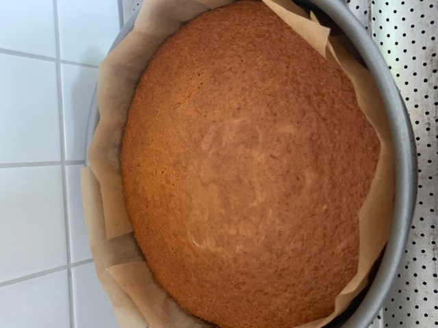
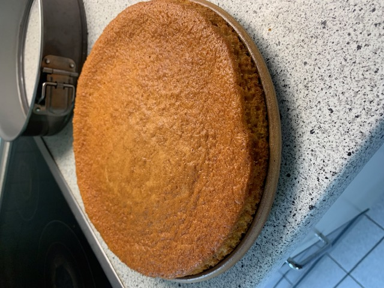
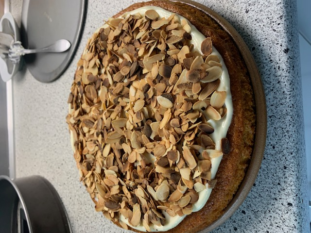
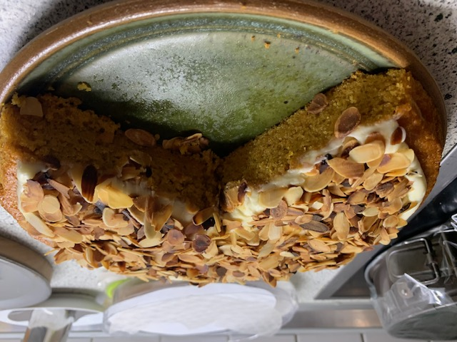

# General

One of the most surprising cakes I've ever eaten... and the best part is it stays fresh forever X-D

# Ingredients

## Cake

* 175 g flour  
* 250 g carrots  
* 3 eggs  
* 120 g sugar  
* 1 packet baking powder  
* 2 packets vanilla sugar  
* 125 ml rapeseed or sunflower oil  
* 1 tsp cinnamon  
* 1 tsp cardamom  
* 1/2 tsp ground ginger  
* a pinch of salt  

## Topping

* 100 g cream cheese – full-fat level X-D  
* 60 g butter  
* 2 tsp lemon juice  
* max 40 g powdered sugar  
* 1 packet sliced almonds or other nuts  

# Preparation

1. Peel, wash (!) and finely grate the carrots  
2. Mix flour with baking powder and spices  
3. Beat eggs, sugar, and vanilla sugar until creamy  
4. Add flour mixture and oil to the eggs and mix well  
5. Prepare a baking tin (round springform) by greasing it or lining with parchment paper  
6. Pour the batter into the baking tin  
7. Bake for 45–50 minutes at 160 °C (top/bottom heat) on the middle rack  
8. Roast the almonds in a pan and let them cool  
9. Mix butter and cream cheese into a smooth mass  
10. Sift the powdered sugar into the mixture and stir  
11. Finally, stir in the lemon juice  
12. Spread the topping on the cooled cake and sprinkle the roasted nuts on top  
13. Done :)  

  
  
  
  
  
  

# Comments

I've also baked the cake with 280 g of carrots. I'm basically curious how much more I can increase the carrot content. For the topping, it's important that it tastes slightly tangy in the end. Even using a slightly saltier cream cheese didn't result in a worse outcome.

The cake stays fresh in the fridge for at least 4 days.
