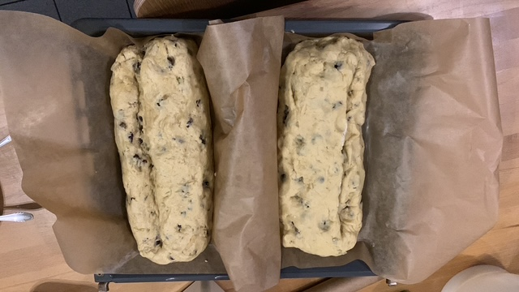
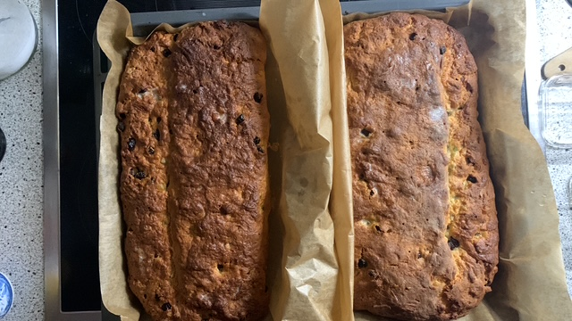
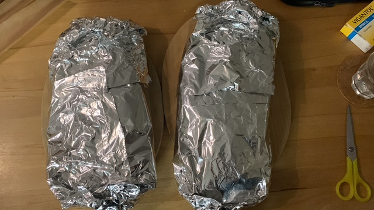

# Allgemein

Ein einfaches Rezept für Weihnachsstollen. Die Vorlage stammt von meiner Schwiegermama Helga. Höchstwahrscheinlich wurde das Rezept von mir im Laufe der Jahre optimiert, aber bis jetzt hat sich noch niemand über die Resultate zu Weihnachten beschwert x-D

Da der Stollen wenigstens 14 Tage nach dem Backen ruhen sollte, bäckt man am besten am 1. Advent
um dann auf die Feiertage vorbereitet zu sein.

Das Folgende Rezept beinhaltet die Zutaten für einen Stollen, aber wenn ich backe, dann backe ich
in der Regel zwei Stollen zu selben Zeit.

# Zusaten

* 500g 550er Mehl
* 100g Zitronat
* 100g geriebene Mandeln
* 200g Rosinen
* 50ml Rum
* 1/4 TL Kadamon (nach belieben)
* 1/4 TL Muskatblüte (nach belieben)
* 1/2 TL Salz
* 150 - 180ml Milch
* 50g Hefe
* 125g Butter
* 40g Butterschmalz (früher wurde Schweineschmalz genommen)
* 90g Magarine
* 100g Zucker
* 8g Vanillezucker
* Schale einer halben geriebenen Bio-Zitrone

# Zubereitung

## Tag vor dem Backen
1. Rosinen in eine Glasschüssel mit dem Rum geben und bis zum nächsten Tag ziehen lassen

## Tag des Backens
1. Zitrone reiben
2. Zitronat kleiner schneiden
3. Butter und Magarine sollten weich sein ...
4. Mich auf Raumtemeratur bringen
5. Alle Zutaten ausser die Rosinen in eine Rührschüssel geben
6. Etwas warten bis die Hefe reagiert ...
7. Dann mit der Küchenmaschine den Teig ordentlich verkneten
8. 2h den Teig ruhen lassen
9. Rosinen zum Teig geben und nochmals kneten
10. 1h den Teig ruhen lassen
11. Stollenteig von Hand kneten und auf ein Bleck mit Backpapier geben.
12. Stollen formen, so dass er die typische Form hat und die frei liegenden Rosinen absammeln 
    oder reindrücken. Überzählige Rosinen unter die Teigkante geben. Am Ende sollten keine Rosinen
    frei an der Oberfläche zu sehen sein. Diese könnten sonst beim Backen austrocknen.
13. Teig 15' ruhen lassen
14. Ofen auf 200°C (Ober- Unterhitze) vorheizen. Eine Schale mit Wasser in den Ofen stellen.
15. Stollen bei 160°C für 60' backen (2. Schiene von unter, oder mittlere Schiene)
16. Wenn der Stollen schön braun ist, ihn aus dem Ofen nehmen und gleich mit reichlich zerlassener
    Butter bepinseln (ca. 80g Butter - mehr schadet nicht x-D)
17. Noch warmen Stollen mit Backpapier einschlagen und in Alufolie einwickeln.
18. Wenn der Stollen kalt ist, alles zusammen in eine Plastiktüte geben und luftdicht verschließen.

... Das Ganze jetzt bis Weihnachten liegen lassen, auch wenn's schwer fällt :D

# Kommentare
Wenn der Teig zu feucht ist, dann neigt er beim Backen zum Zerlaufen. Aus diesem Grund "klemme"
ich entweder den rohen Teig irgendwie ein, backe in einer Form (niemand mag das zu Hause) oder
ich lebe einfach mit dem breitgelaufenen Stollen ;-)

Ich habe die Mengen im Laufe der Zeit an handelsübliche Packungsgrößen angepasst. Alles
in allem kann man bei dem Rezept nicht viel falsch machen, damit bietet es Raum für
Experimente.