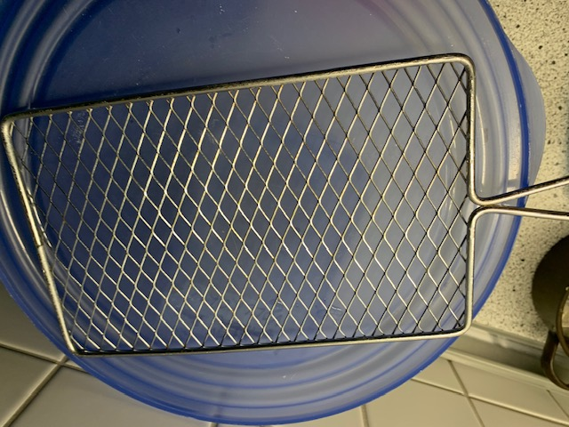
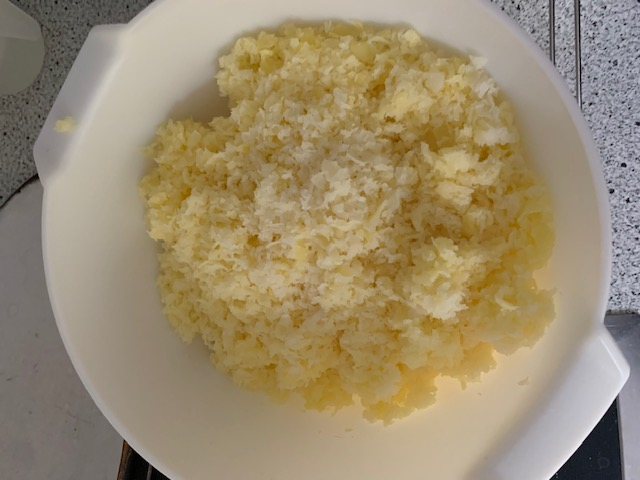
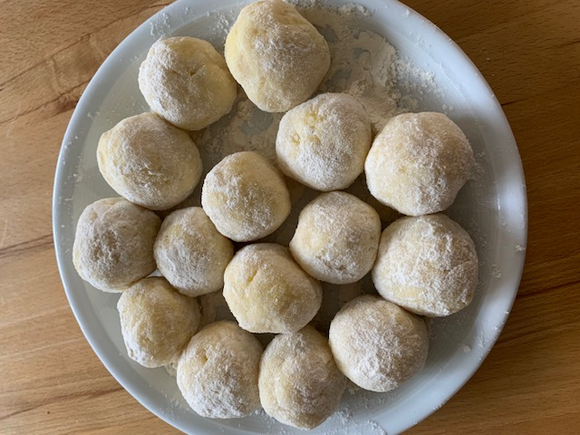

Here’s the translated recipe for "Helga's Potato Dumplings":

---

# General

**Potato Dumplings, Helga's Style**

These dumplings pair wonderfully with any kind of Christmas roast! :D

# Ingredients

* 2.5 kg floury potatoes
* 200 g flour
* 100 g cornstarch
* 3 eggs
* Salt
* Nutmeg

# Instructions

## Day 1: Preparation

1. Boil the potatoes in salted water until tender but not too soft (approx. 15 minutes).
2. Drain the potatoes thoroughly and let them steam off completely.

## Day 2: Cooking Day

1. Grate the potatoes. Use a very coarse wire-mesh grater and discard any remaining large pieces.

2. Mix the grated potatoes with the flour, cornstarch, eggs, salt, and nutmeg – do not knead, just fold together gently.
3. Shape the mixture into dumplings about 3 cm in diameter, roll them in flour, and set them on a plate.

4. Bring a large pot of water to a boil, then add a generous amount of salt (4 teaspoons). The dumplings should be fully submerged later.
5. Carefully add the dumplings to the boiling water and reduce the heat so that the water is no longer boiling. Only add enough dumplings to cover the bottom of the pot.
6. Once the dumplings float to the surface (after about 15 minutes), remove them with a slotted spoon and keep warm.
7. Add more dumplings to the water and cook them in the same way.
8. Repeat until all dumplings are cooked.

# Notes

* Labor-intensive but simple.
* 2.5 kg of potatoes makes about 35 dumplings. Four people typically need about 15 dumplings. 

